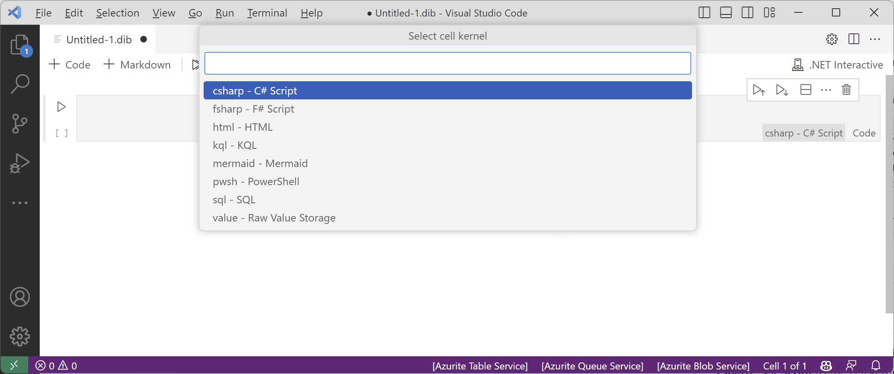
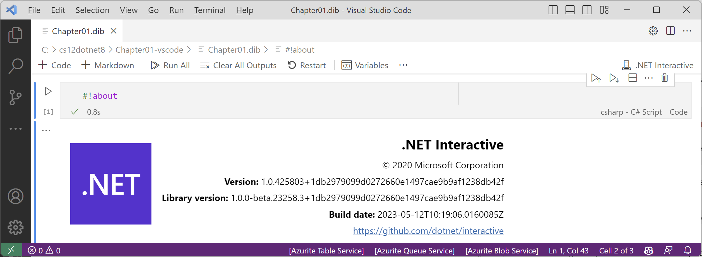

**Polyglot Notebooks**

> Solution notebooks for all chapters can be found here: [../code/notebooks](../code/notebooks)

- [Learning to code using the Polyglot Notebooks extension](#learning-to-code-using-the-polyglot-notebooks-extension)
- [Exploring code using Polyglot Notebooks](#exploring-code-using-polyglot-notebooks)
- [Creating a notebook](#creating-a-notebook)
- [Writing and running code in a notebook](#writing-and-running-code-in-a-notebook)
- [Saving a notebook](#saving-a-notebook)
- [Adding Markdown and special commands to a notebook](#adding-markdown-and-special-commands-to-a-notebook)
- [Executing code in multiple cells](#executing-code-in-multiple-cells)

> **Warning!** At the time of publishing in November 2025, the Polyglot Notebooks extension will still require .NET 9 SDK. It will likely be updated to support or require .NET 10 within a month.

# Learning to code using the Polyglot Notebooks extension   

The **Polyglot Notebooks** extension for VS Code provides an easy and safe place to write simple code snippets for experimenting and learning. For example, data scientists use them to analyze and visualize data. Students use them to learn how to write small pieces of code for language constructs and to explore APIs.

Polyglot Notebooks enables you to create a single notebook file that mixes "cells" of Markdown (richly formatted text) and code, using C# and other related languages, such as PowerShell, F#, and SQL (for databases). The extension does this by hosting an instance of the .NET Interactive engine.

The old name for the Polyglot Notebooks extension was the **.NET Interactive Notebooks** extension, but it was renamed because it is not limited to .NET languages like C# and F#. The extension retains its original identifier, `ms-dotnettools.dotnet-interactive-vscode`.

Polyglot Notebooks has some limitations:
- It cannot be used to create websites, services, and apps.
- You cannot use `Console` class methods like `ReadLine` or `ReadKey` to get input from the user. (However, there are alternative methods, which you will learn about later in this online section.)
- Notebooks cannot have arguments passed to them.
- It does not allow you to define your own namespaces.
- It does not have any debugging tools (yet).

# Exploring code using Polyglot Notebooks

Polyglot Notebooks makes writing code even easier than top-level programs. It requires VS Code, so if you did not install it and the Polyglot Notebooks extension earlier, please install them now.

Visual Studio does have its own extension for notebooks named **Notebook Editor** that was created by Microsoft's machine learning team. It is not as mature as the Polyglot Notebooks extension for VS Code, so I do not recommend it. You can learn more and install Notebook Editor from the following link:
https://marketplace.visualstudio.com/items?itemName=MLNET.notebook

# Creating a notebook

First, we need to create a notebook:
1. In VS Code, navigate to **File** | **Close Workspace**.
2. Navigate to **View** | **Command Palette**.
3. Type `poly`, and then select **Polyglot Notebook: Create new blank notebook**, as shown in *Figure 1.16*:


*Figure 1.16: Creating a new blank polyglot notebook*

1. When prompted to select the file extension, choose **Create as** `.dib`.

> `.dib` is an experimental file format defined by Microsoft to avoid confusion and compatibility issues with the `.ipynb` format used by Python interactive notebooks. The file extension was historically only for Jupyter notebooks that can contain an interactive (I) mix of data, Python code (PY), and output in a notebook file (NB). With Polyglot Notebooks, the concept has expanded to allow a mix of C#, F#, SQL, HTML, JavaScript, Markdown, and other languages. `.dib` is polyglot, meaning it supports mixed languages. Conversion between the `.dib` and `.ipynb` file formats is supported.

5. For the **Default Language** for code cells in the notebook, select **C#**.

> If a newer version of the .NET Interactive engine is available, you might have to wait for it to uninstall the older version and install the newer one. 

6. Navigate to **View** | **Output** and select **Polyglot Notebook : diagnostics** in the drop-down list. Please be patient. It can take a few minutes for the notebook to appear because it must start up a hosting environment for .NET. If nothing happens after a few minutes, then close VS Code and restart it.

7. Once the Polyglot Notebooks extension is downloaded and installed, the OUTPUT window diagnostics will show that a kernel process has started (your process numbers will be different from the output below), as shown in the following output:
```
Extension started for VS Code Stable.
Started process 2344: dotnet tool run dotnet-interactive -- notebook-parser
Starting kernel for 'untitled:Untitled-1.dib?polyglot-notebook' using: dotnet tool run dotnet-interactive -- [vscode] stdio --working-dir C:\Users\markj\Downloads
Kernel for 'untitled:Untitled-1.dib?polyglot-notebook' started (26348).
```

# Writing and running code in a notebook

Next, we can write code in the notebook cells:

1. The first cell should already be set to **csharp - C# Script**, but if it is set to anything else, then click the cell kernel selector in the bottom-right corner of the code cell and then select **csharp - C# Script** as the cell kernel, and note your other choices of language for a code cell, as shown in *Figure 1.17*:



*Figure 1.17: Changing the language for a code cell in a polyglot notebook*

1. Inside the **csharp - C# Script** code cell, enter a statement to output a message to the console, and note that you do not need to end the statement with a semicolon, as you normally would in a full application, as shown in the following code:
```cs
Console.WriteLine("Hello, .NET notebook!")
```

1. Click the **Execute Cell** button to the left of the code cell and note the output that appears under the code cell, as shown in *Figure 1.18*:


*Figure 1.18: Executing a cell in a polyglot notebook and seeing the output below*

# Saving a notebook

Like any other file, we should save the notebook before continuing further:

1. Navigate to **File** | **Save As…**.
2. Change to the `Chapter01-vscode` folder and save the notebook as `Chapter01.dib`.
3. Close the **Chapter01.dib** editor tab.

# Adding Markdown and special commands to a notebook

We can mix and match cells containing Markdown and code with special commands:

1.	Navigate to **File** | **Open File…** and select the `Chapter01.dib` file.
2. Hover your mouse above the code block and click **+ Markdown** to add a Markdown cell.
3. Type a heading level 1 and a normal paragraph with some styles applied to some words, as shown in the following Markdown:
```md
# Chapter 1 - Hello, C#! Welcome, .NET!

Mixing *rich* **text** and code is cool!
```

4. Click the tick in the top-right corner of the cell to stop editing the cell and view the processed Markdown.

> If your cells are in the wrong order, then you can drag and drop to rearrange them.

5. Hover between the Markdown cell and the code cell and click **+ Code**.
6. Type a special command to output version information about the .NET Interactive engine used by Polyglot Notebooks, as shown in the following code:
```
#!about
```
7. Click the **Execute Cell** button and note the output, as shown in *Figure 1.19*:
 


*Figure 1.19: Mixing Markdown, code, and special commands in a polyglot notebook*

# Executing code in multiple cells

When you have multiple code cells in a notebook, you must execute the preceding code cells before their context becomes available in subsequent code cells:

1. At the bottom of the notebook, add a new code cell, and then type a statement to declare a variable and assign an integer value, as shown in the following code:
```cs
int number = 8;
```

2. At the bottom of the notebook, add a new code cell, and then type a statement to output the number variable, as shown in the following code:
```cs
Console.WriteLine(number);
```

3. Note the second code cell does not know about the number variable because it was defined and assigned in another code cell, aka context, as shown in *Figure 1.20*:


*Figure 1.20: The number variable does not exist in the current cell or context*

4. In the first cell, click the **Execute Cell** button to declare and assign a value to the variable.
5. In the second cell, click the **Execute Cell** button to output the number variable, and note that this works. (Alternatively, in the first cell, you can click the **Execute Cell and Below** button in the mini-toolbar in the top-right corner of that cell.)

> **Good Practice**: If you have related code split between two or more cells, remember to execute the preceding cells before executing the subsequent cells. At the top of the notebook, there are the following buttons: **Clear Outputs** and **Run All**. These are very handy because you can click one and then the other to ensure that all code cells are executed properly.

